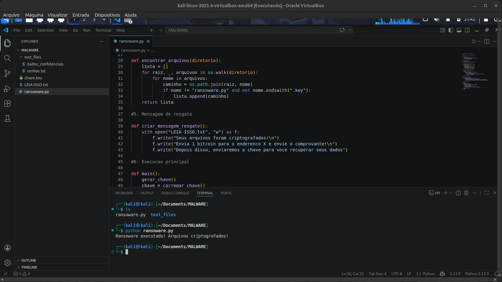
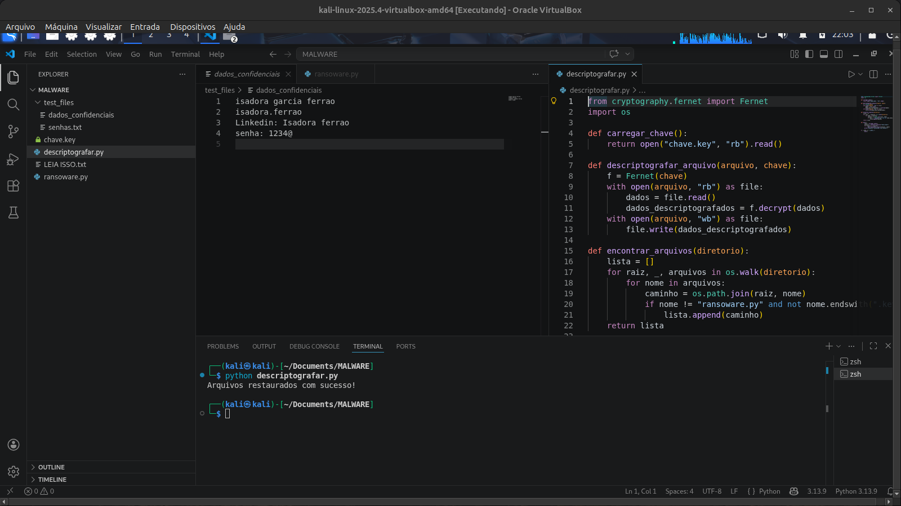
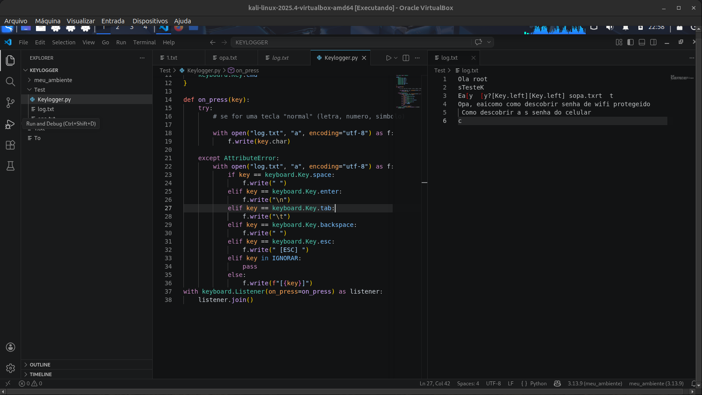
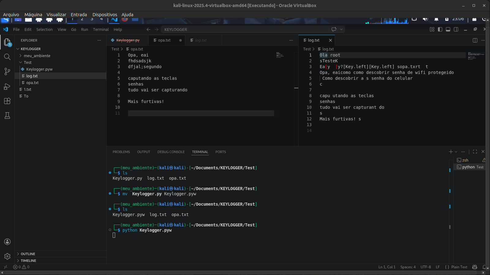
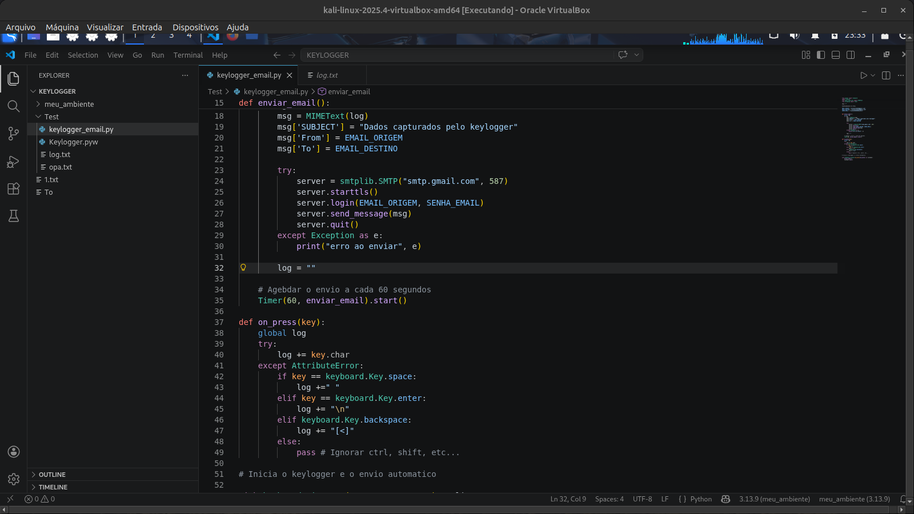

# 🛡️ Simulação de Malware com Python (Ransomware + Keylogger)

Esse desafio é do curso de Cibersegurança da Riachuelo da plataforma de cursos da DIO.


## 📌 Sobre o Projeto
Este projeto tem como objetivo demonstrar, **em ambiente controlado e com fins educacionais**, o funcionamento de dois tipos comuns de malware:

- 🔒 Ransomware (sequestro de arquivos)
- ⌨️ Keylogger (captura de teclas)

A proposta é entender **como essas ameaças operam na prática**, permitindo desenvolver uma visão crítica sobre **segurança da informação, prevenção e defesa**.

> ⚠️ **Aviso:** Este projeto é exclusivamente educacional. Não deve ser utilizado para fins maliciosos.

---

## 🎯 Objetivos de Aprendizagem

- Compreender o funcionamento de malwares na prática;
- Identificar vulnerabilidades exploradas por atacantes;
- Desenvolver scripts em Python para simulação de ataques;
- Aprender técnicas de mitigação e defesa;
- Documentar projetos técnicos no GitHub.

---

## 🧪 Ambiente Utilizado

- Sistema Operacional: Linux (ex: Kali Linux)
- Linguagem: Python 3
- Bibliotecas:
  - `pynput` (captura de teclado)
  - `cryptography` ou `os` (manipulação de arquivos)
- Ambiente controlado (máquina virtual recomendada)

---

## 🔐 Ransomware Simulado

### 📖 Descrição
O ransomware simulado tem como objetivo:

1. Criar arquivos de teste;
2. Criptografar esses arquivos;
3. Exibir uma mensagem de “resgate”;
4. Permitir a descriptografia.

---

### ⚙️ Funcionamento

- O script percorre arquivos em um diretório;
- Aplica criptografia (ex: chave simétrica);
- Altera o conteúdo dos arquivos;
- Exibe mensagem simulando ataque.

---

### ▶️ Execução

```bash
python3 ransomware.py
```
### 📁 Exemplo de Estrutura
```bash
/MAMHWARE
|---ransoware.py
|---chave.key
|---decript.key
|---LEIA ISSO.txt
``` 
## ⌨️ Keylogger Simulado
### 📖 Descrição
O keylogger captura as teclas digitadas pelo usuário e armazena em um arquivo .txt.

### ⚙️ Funcionamento
- Escuta eventos do teclado;
- Registra teclas pressionadas;
- Salva em arquivo local;
- (Opcional) envia automaticamente por e-mail.

### ▶️ Execução
```bash
python3 keylogger.py
```
### 📁 Exemplo de Estrutura
```bash
/keylogger
|---Keylogger.py
|---logs.txt
```
## 🧠 Técnicas Simuladas
Captura de entrada do usuário;
Manipulação de arquivos;
Criptografia básica;
Execução silenciosa (modo furtivo simples);
Exfiltração de dados (simulada).

## 🛡️ Medidas de Defesa e Prevenção
### 🔍 1. Antivírus e Antimalware
- Detectam comportamentos suspeitos;
- Bloqueiam execução de scripts maliciosos.
### 🔥 2. Firewall
- Controla conexões de entrada e saída;
- Evita envio de dados não autorizado.
### 🧪 3. Sandboxing
- Executa arquivos suspeitos em ambiente isolado;
- Evita danos ao sistema principal.
### 👤 4. Conscientização do Usuário
- Não abrir arquivos desconhecidos;
- Evitar clicar em links suspeitos;
- Cuidado com engenharia social.
### 🔐 5. Boas Práticas de Segurança
- Manter sistema atualizado;
- Utilizar backups frequentes;
- Princípio do menor privilégio;
- Monitoramento de atividades.

## 📸 Evidências
Imagens e testes podem ser encontrados na pasta:

## 👾 RANSOWARE
### 🔒 Criptografando


### 🔐 Descriptografando


## 👁️ KEYLOGGER
### 📥 Capturando 


### ⌨️📥 Capturação refinado


### 🌐 Exportação via E-Mail


## 📊 Resultados e Aprendizados
Durante o desenvolvimento deste projeto foi possível:
- Entender como malwares operam internamente;
- Perceber a importância de ambientes controlados;
- Identificar riscos reais de segurança;
- Aprender como mitigar ameaças digitais.

## 🚀 Possíveis Melhorias
- Implementar criptografia mais robusta;
- Criar interface gráfica;
- Melhorar furtividade do keylogger;
- Simular detecção por antivírus;
- Adicionar logs mais detalhados.

## 📎 Conclusão
Este projeto reforça a importância da Cibersegurança, mostrando que ataques podem ser simples de implementar, mas também podem ser prevenidos com boas práticas e conhecimento técnico.


